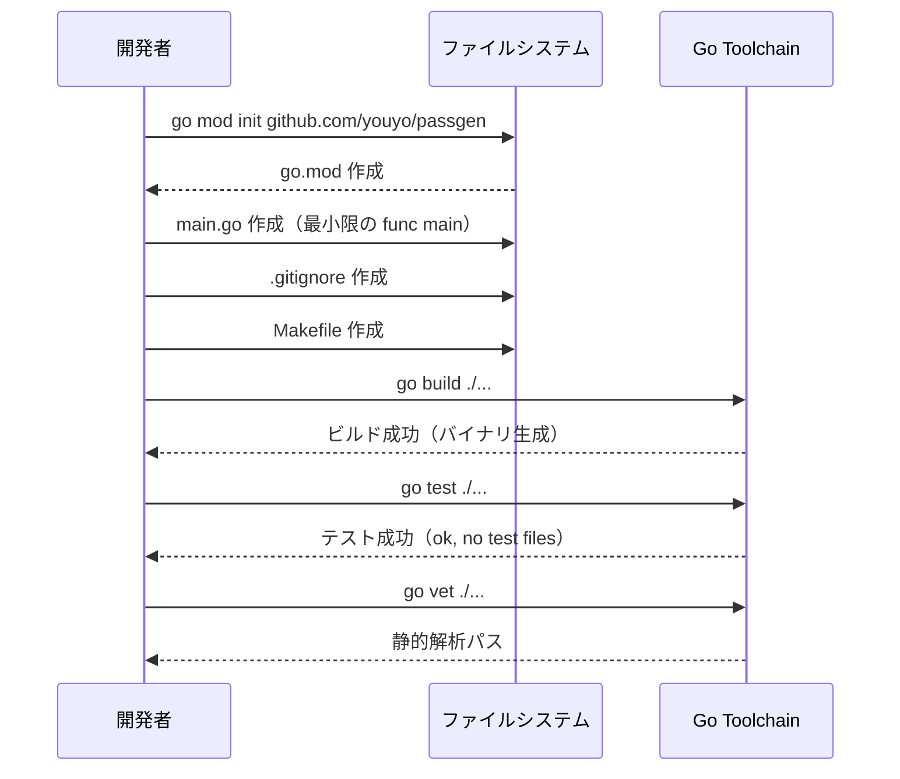

# M01: プロジェクト初期化

## Overview
| 項目 | 値 |
|------|---|
| ステータス | 未着手 |
| 依存 | なし |
| 対象ファイル | go.mod, main.go, .gitignore, Makefile |

## Goal
ビルド・テスト実行可能な空の Go プロジェクトを構築する。以降の全マイルストーンの基盤となる。

## Sequence Diagram



## TDD Test Design

M01 は初期化マイルストーンのため、ユニットテストではなくスモークテストで検証する。

| # | テストケース | コマンド | 期待結果 |
|---|-------------|---------|---------|
| 1 | プロジェクトがビルドできる | `go build ./...` | exit code 0、エラーなし |
| 2 | テストが実行できる | `go test ./...` | exit code 0（テストファイルなしでも成功） |
| 3 | 静的解析がパスする | `go vet ./...` | exit code 0 |
| 4 | モジュールパスが正しい | `go.mod` の module 行 | `github.com/youyo/passgen` |
| 5 | Makefile の build ターゲット | `make build` | バイナリ `passgen` が生成される |
| 6 | Makefile の test ターゲット | `make test` | `go test ./...` が実行される |
| 7 | Makefile の lint ターゲット | `make lint` | `go vet ./...` が実行される |

## Implementation Steps

- [ ] Step 1: `go mod init github.com/youyo/passgen` を実行
  - Go の最新安定版（1.24 系）を使用
  - module パス: `github.com/youyo/passgen`

- [ ] Step 2: `main.go` を作成
  ```go
  package main

  import "fmt"

  func main() {
      fmt.Println("passgen")
  }
  ```
  - 最小限のエントリポイント。M04 で Kong に置き換え

- [ ] Step 3: `.gitignore` を作成
  - Go バイナリ（`/passgen`）
  - OS ファイル（`.DS_Store`）
  - IDE ファイル（`.idea/`, `.vscode/`）
  - `dist/`（goreleaser 出力）

- [ ] Step 4: `Makefile` を作成
  - `build`: `go build -o passgen .`
  - `test`: `go test -v -race ./...`
  - `lint`: `go vet ./...`
  - `clean`: `rm -f passgen`
  - `.PHONY` 宣言

- [ ] Step 5: スモークテスト実行
  - `go build ./...` → 成功
  - `go test ./...` → 成功
  - `go vet ./...` → 成功
  - `make build` → `passgen` バイナリ生成
  - `./passgen` → "passgen" が出力される

## Risks
| リスク | 影響度 | 対策 |
|--------|--------|------|
| Go バージョン不一致 | 低 | go.mod で最小バージョンを指定 |
| なし | - | 最も安全なマイルストーン |

## Verification Checklist
- [ ] `go build ./...` が exit code 0
- [ ] `go test ./...` が exit code 0
- [ ] `go vet ./...` が exit code 0
- [ ] `make build` で `passgen` バイナリが生成される
- [ ] `./passgen` を実行して "passgen" が出力される
- [ ] `.gitignore` にバイナリと OS ファイルが含まれている
