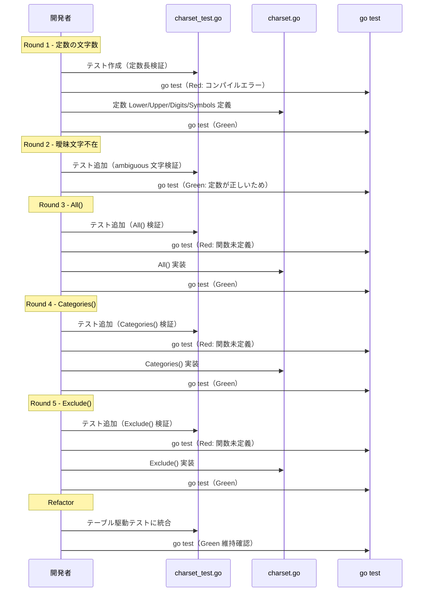

# M02: 文字セット定義 — 詳細実装計画

## Meta
| 項目 | 値 |
|------|---|
| マイルストーン | M02 |
| パッケージ | `internal/charset/` |
| ファイル | `charset.go`, `charset_test.go` |
| 依存 | なし（純粋な文字列操作、外部依存ゼロ） |
| 前提 | M01 完了済み（go.mod, Makefile, main.go 存在） |

## 1. 要件サマリー

### 1.1 文字列定数（曖昧文字除外済み）
| カテゴリ | 定数値 | 除外文字 | 文字数 |
|----------|--------|----------|--------|
| Lower | `abcdefghijkmnopqrstuvwxyz` | `l` | 25 |
| Upper | `ABCDEFGHJKLMNPQRSTUVWXYZ` | `I`, `O` | 24 |
| Digits | `23456789` | `0`, `1` | 8 |
| Symbols | `-_.~` | なし | 4 |
| **合計** | | | **61** |

### 1.2 公開関数
| 関数 | シグネチャ | 説明 |
|------|-----------|------|
| `All()` | `func All() string` | 全カテゴリを結合した文字列を返す |
| `Exclude()` | `func Exclude(base, excluded string) string` | base から excluded に含まれる文字を除去 |
| `Categories()` | `func Categories() []string` | 各カテゴリを個別要素としたスライスを返す |

## 2. TDD 設計（Red → Green → Refactor）

### Round 1: 定数の文字数検証
**Red**: 各定数の `len()` を検証するテストを書く
```go
func TestLowerLength(t *testing.T) {
    if len(Lower) != 25 { t.Errorf(...) }
}
func TestUpperLength(t *testing.T) {
    if len(Upper) != 24 { t.Errorf(...) }
}
func TestDigitsLength(t *testing.T) {
    if len(Digits) != 8 { t.Errorf(...) }
}
func TestSymbolsLength(t *testing.T) {
    if len(Symbols) != 4 { t.Errorf(...) }
}
```
**Green**: 定数を定義して文字数を合わせる
**Refactor**: テストをテーブル駆動に統合

### Round 2: 曖昧文字の不在検証
**Red**: 曖昧文字（`l`, `I`, `O`, `0`, `1`）が各定数に含まれないことを検証
```go
func TestNoAmbiguousCharacters(t *testing.T) {
    ambiguous := "lIO01"
    for _, c := range ambiguous {
        if strings.ContainsRune(Lower, c) { t.Errorf(...) }
        if strings.ContainsRune(Upper, c) { t.Errorf(...) }
        if strings.ContainsRune(Digits, c) { t.Errorf(...) }
        if strings.ContainsRune(Symbols, c) { t.Errorf(...) }
    }
}
```
**Green**: Round 1 で既に通っているはず（定数が正しければ）
**Refactor**: 不要

### Round 3: All() 関数
**Red**: `All()` が全カテゴリ結合であること、長さが 61 であることを検証
```go
func TestAll(t *testing.T) {
    all := All()
    expected := Lower + Upper + Digits + Symbols
    if all != expected { t.Errorf(...) }
    if len(all) != 60 { t.Errorf(...) }
}
```
**Green**: `func All() string { return Lower + Upper + Digits + Symbols }`
**Refactor**: 不要

### Round 4: Categories() 関数
**Red**: `Categories()` が 4 要素のスライスを返し、各要素が正しいことを検証
```go
func TestCategories(t *testing.T) {
    cats := Categories()
    if len(cats) != 4 { t.Errorf(...) }
    if cats[0] != Lower { ... }
    if cats[1] != Upper { ... }
    if cats[2] != Digits { ... }
    if cats[3] != Symbols { ... }
}
```
**Green**: `func Categories() []string { return []string{Lower, Upper, Digits, Symbols} }`
**Refactor**: 不要

### Round 5: Exclude() 関数
**Red**: 基本ケース + エッジケースのテスト
```go
func TestExclude(t *testing.T) {
    // 基本: 文字除去
    result := Exclude("abcdef", "bd")
    if result != "acef" { t.Errorf(...) }
    
    // excluded が空 → base そのまま
    if Exclude("abc", "") != "abc" { ... }
    
    // base が空 → 空文字列
    if Exclude("", "abc") != "" { ... }
    
    // 存在しない文字を除外 → base そのまま
    if Exclude("abc", "xyz") != "abc" { ... }
    
    // 全文字除外 → 空文字列
    if Exclude("abc", "abc") != "" { ... }
}
```
**Green**: `strings.Map` または手動ループで実装
**Refactor**: 最もシンプルな実装を選択

## 3. 実装ステップ

| # | ステップ | 説明 |
|---|---------|------|
| 1 | ディレクトリ作成 | `internal/charset/` を作成 |
| 2 | テストファイル作成 | `charset_test.go` を Round 1 のテストで作成（Red） |
| 3 | 定数定義 | `charset.go` に定数を定義（Green） |
| 4 | テスト実行 | `go test ./internal/charset/` で Green 確認 |
| 5 | Round 2 テスト追加 | 曖昧文字不在テスト（Red → 即 Green） |
| 6 | Round 3 テスト追加 | `All()` テスト（Red） |
| 7 | `All()` 実装 | Green |
| 8 | Round 4 テスト追加 | `Categories()` テスト（Red） |
| 9 | `Categories()` 実装 | Green |
| 10 | Round 5 テスト追加 | `Exclude()` テスト（Red） |
| 11 | `Exclude()` 実装 | Green |
| 12 | Refactor | テーブル駆動テストへの統合、コード整理 |
| 13 | 全テスト実行 | `go test -v -race ./...` で最終確認 |
| 14 | コミット | 日本語コミットメッセージで `git add` & `git commit` |

## 4. シーケンス図



## 5. リスク評価

| リスク | 影響 | 確率 | 対策 |
|--------|------|------|------|
| Upper の文字数が仕様と異なる | 中 | 低 | テストで文字数を厳密に検証。手動で文字列を数えて確認 |
| Exclude() で Unicode 問題 | 低 | 極低 | ASCII 文字のみなので `byte` レベルで安全。`strings.ContainsRune` を使用 |
| All() の結合順序に依存するコード | 低 | 低 | 結合順序をテストで固定。ドキュメントに明記 |
| symbols の `~` が将来問題に | 低 | 極低 | URL-safe 仕様に基づく選定。RFC 3986 準拠 |

## 6. 設計判断

1. **定数は `const` で公開**: 他パッケージ（generator）から直接参照するため
2. **Exclude() は新しい string を返す**: 元の文字列を変更しない純粋関数
3. **Categories() は毎回新しいスライスを返す**: 呼び出し元による変更の影響を防止
4. **テーブル駆動テスト**: Go の慣習に従い、保守性を高める

## 7. 完了基準

- [ ] `go test -v -race ./internal/charset/` が全 PASS
- [ ] `go vet ./internal/charset/` がエラーなし
- [ ] 曖昧文字（l, I, O, 0, 1）が定数に含まれないことをテストで検証
- [ ] 全カテゴリ合計文字数が 61 であることをテストで検証
- [ ] `Exclude()` のエッジケース（空文字列、存在しない文字、全除去）をテストで検証
