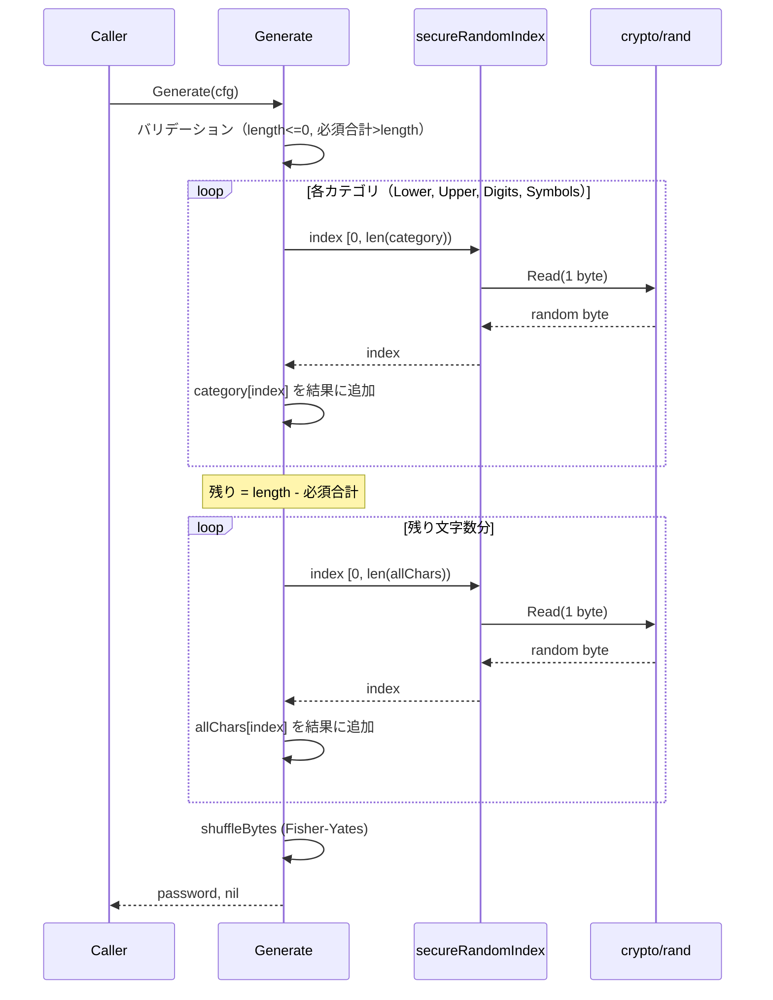

# M03: パスワード生成コアロジック 実装詳細計画

## Meta
| 項目 | 値 |
|------|---|
| マイルストーン | M03 |
| パッケージ | `internal/generator` |
| 依存 | `internal/charset`（M02完了済み） |
| 乱数源 | `crypto/rand` |
| 作成日 | 2026-04-02 |

## 1. 設計概要

### 1.1 Config 構造体

```go
type Config struct {
    Length  int // パスワード長（デフォルト: 20）
    Lower   int // 小文字の最低文字数（デフォルト: 1）
    Upper   int // 大文字の最低文字数（デフォルト: 1）
    Digits  int // 数字の最低文字数（デフォルト: 1）
    Symbols int // 記号の最低文字数（デフォルト: 1）
}
```

> **設計決定（advocate レビュー反映）**: Charset / CategoryCharsets フィールドは YAGNI 原則により削除。
> Generate 内部で `charset.All()` と `charset.Categories()` を直接使用する。
> M06（--exclude フラグ）で必要になった時点で再設計する。

### 1.2 公開API

```go
// DefaultConfig はデフォルト設定を返す。
func DefaultConfig() Config

// Generate はConfigに基づいてパスワードを生成する。
func Generate(cfg Config) (string, error)
```

### 1.3 内部ヘルパー

```go
// secureRandomIndex は [0, max) の範囲で暗号学的に安全な乱数インデックスを返す。
// モジュラスバイアスを回避するため rejection sampling を使用する。
func secureRandomIndex(max int) (int, error)

// shuffleBytes はFisher-Yatesアルゴリズムでバイト列をシャッフルする。
// crypto/randベース。
func shuffleBytes(b []byte) error
```

## 2. 生成ロジック（シーケンス図）



## 3. モジュラスバイアス回避

`secureRandomIndex` は rejection sampling を使用する:

```
1. max が 0 以下の場合はエラー
2. threshold = (256 - (256 % max)) を計算（256 = 1バイトの範囲）
   ※ Go では: threshold = 256 % uint(max) として、256 - threshold がリジェクト閾値
   ※ 実際には math/big を使わず、以下のアプローチ:
     - threshold = (256 / max) * max  (max以下の最大の256の倍数)
     - ランダムバイト r が threshold 以上ならリジェクト
3. crypto/rand.Read で1バイト取得
4. r < threshold なら r % max を返す
5. そうでなければ再試行
```

これにより最大でも 1/256 のリジェクト率でモジュラスバイアスを完全に排除する。

## 4. Fisher-Yatesシャッフル

```
for i := len(b) - 1; i > 0; i-- {
    j, err := secureRandomIndex(i + 1)
    if err != nil { return err }
    b[i], b[j] = b[j], b[i]
}
```

crypto/rand ベースの secureRandomIndex を使用するため、シャッフルの均一性が保証される。

## 5. エラー条件

| 条件 | エラーメッセージ |
|------|-------------|
| `length <= 0` | `"length must be positive"` |
| `必須合計 > length` | `"required minimum characters (N) exceeds length (M)"` |
| `Charset が空` | `"charset is empty"` |
| `カテゴリの最低数 > 0 だが該当カテゴリの文字セットが空` | `"category N has no available characters"` |
| `crypto/rand 失敗` | crypto/rand のエラーをラップして返す |

## 6. TDD テストケース（Red → Green → Refactor）

### Round 1: バリデーション系（Red → Green）
```
1. TestGenerate_LengthZero_ReturnsError
   - cfg.Length = 0 → error "length must be positive"

2. TestGenerate_NegativeLength_ReturnsError
   - cfg.Length = -1 → error "length must be positive"

3. TestGenerate_RequiredExceedsLength_ReturnsError
   - cfg.Length = 3, Lower=1, Upper=1, Digits=1, Symbols=1 (合計4>3) → error
```

### Round 2: 基本生成（Red → Green）
```
4. TestGenerate_DefaultConfig_Returns20Chars
   - DefaultConfig() で生成 → len(password) == 20

5. TestGenerate_Length100_ReturnsCorrectLength
   - cfg.Length = 100 → len(password) == 100

6. TestGenerate_Length4_AllCategories
   - cfg.Length = 4, 各カテゴリ最低1 → 各カテゴリから最低1文字含有
```

### Round 3: カテゴリ保証（統計テスト）（Red → Green）
```
7. TestGenerate_DefaultConfig_ContainsAllCategories_Statistical
   - 1000回生成、毎回4カテゴリ全てを含有することを検証

8. TestGenerate_SymbolsMin3_Statistical
   - cfg.Symbols = 3, 100回生成 → 毎回symbol 3文字以上
```

### Round 4: 一意性・文字セット検証（Red → Green）
```
9. TestGenerate_TwoConsecutive_AreDifferent
   - 2回連続生成 → 異なるパスワード（確率的にほぼ確実）

10. TestGenerate_NoAmbiguousCharacters
    - 1000回生成 → 曖昧文字(l, I, O, 0, 1)を含まない

11. TestGenerate_OnlyValidCharacters
    - 生成パスワードの全文字が charset.All() に含まれる
```

### Round 5: secureRandomIndex 検証（Red → Green）
```
12. TestSecureRandomIndex_ReturnsWithinRange
    - max=10 で10000回実行 → 全て [0, 10) の範囲

13. TestSecureRandomIndex_Distribution
    - max=6 で60000回実行 → 各値の出現率が期待値±5%以内

14. TestSecureRandomIndex_MaxOne_ReturnsZero
    - max=1 → 常に0を返す

15. TestSecureRandomIndex_MaxZero_ReturnsError
    - max=0 → error
```

### Round 6: DefaultConfig 検証（Red → Green）
```
16. TestDefaultConfig_Values
    - Length=20, Lower=1, Upper=1, Digits=1, Symbols=1
```

### Refactor フェーズ
- 各Round完了後にコード整理
- **sentinel error を導入**（advocate レビュー反映）:
  ```go
  var (
      ErrLengthNotPositive    = errors.New("length must be positive")
      ErrRequiredExceedsLength = errors.New("required minimum characters exceeds length")
  )
  ```
  テストでは `errors.Is()` で検証する
- godoc コメント整備

## 7. 実装ステップ

### Step 1: ファイル構成
```
internal/generator/
├── generator.go       # Config, DefaultConfig, Generate
├── random.go          # secureRandomIndex, shuffleBytes
└── generator_test.go  # 全テストケース
```

### Step 2: 実装順序（TDD）

1. **`generator_test.go`**: Round 1 テスト作成（Red）
2. **`generator.go`**: Config, DefaultConfig, Generate のバリデーション部分（Green）
3. **`random.go`**: secureRandomIndex（Max=0エラーのみ）（Green）
4. **`generator_test.go`**: Round 5 テスト作成（Red）
5. **`random.go`**: secureRandomIndex 完全実装（Green）
6. **`generator_test.go`**: Round 2 テスト作成（Red）
7. **`generator.go`**: Generate のコア生成ロジック（Green）
8. **`generator_test.go`**: Round 3-4 テスト作成（Red → Green）
9. **Refactor**: コード整理、godoc
10. **`generator_test.go`**: Round 6 テスト作成 → 全テスト Green 確認

## 8. リスク評価

| リスク | 影響 | 対策 |
|--------|------|------|
| crypto/rand が CI で失敗 | テスト不安定 | crypto/rand は /dev/urandom を使用するため実質的に失敗しない。エラーハンドリングはコードパスとして存在するが統計テストでカバー |
| モジュラスバイアス | セキュリティ低下 | rejection sampling で完全排除。分布テストで検証 |
| シャッフルの均一性不足 | パスワードの予測可能性 | Fisher-Yates + crypto/rand で理論的に均一。統計テストで分布検証 |
| 統計テストの偽陽性 | CI の不安定化 | 十分なサンプル数（1000回以上）と緩い許容範囲（±5%）で偽陽性を最小化 |
| CategoryCharsets の不整合 | 生成失敗 | バリデーションで空カテゴリをチェック。デフォルトではcharset.Categories()を使用 |

## 9. 依存関係

- `internal/charset`: Lower, Upper, Digits, Symbols, All(), Categories(), Exclude()
- `crypto/rand`: 暗号学的に安全な乱数生成
- `errors`/`fmt`: エラー処理
- 外部パッケージ依存: なし

## 10. 完了基準

- [ ] 全16テストケースが Green
- [ ] `go vet ./internal/generator/...` クリーン
- [ ] godoc コメント完備
- [ ] モジュラスバイアスが rejection sampling で回避されている
- [ ] Fisher-Yates シャッフルが crypto/rand ベースで実装されている
