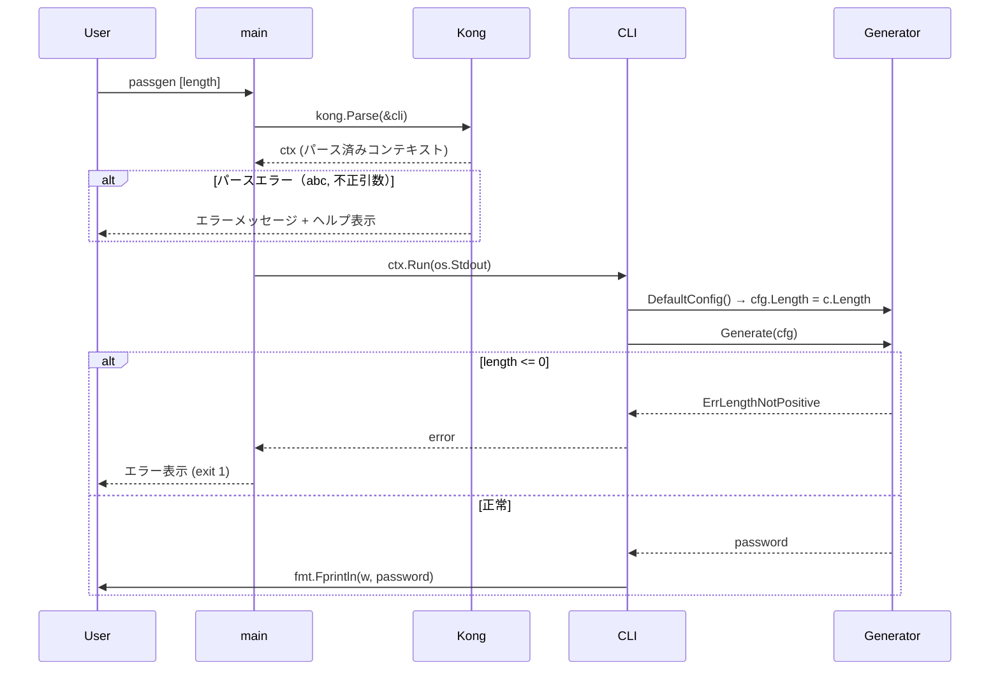

# M04: CLI基盤（Kong + length引数）実装詳細計画

## Meta
| 項目 | 値 |
|------|---|
| マイルストーン | M04 |
| パッケージ | `internal/cli` （新規作成）、`main.go` 改修 |
| 依存 | M03完了済み（`internal/generator`）、Kong CLI フレームワーク |
| 外部依存 | `github.com/alecthomas/kong` |
| 作成日 | 2026-04-02 |

## 1. 設計概要

### 1.1 CLI構造体

```go
// internal/cli/cli.go
package cli

// CLI は Kong CLI の構造体定義。
type CLI struct {
    Length int `arg:"" optional:"" default:"20" env:"PASSGEN_LENGTH" help:"パスワードの文字数（デフォルト: 20）"`
}
```

**設計決定**:
- `arg:""` で位置引数として定義
- `optional:""` で省略可能
- `default:"20"` でデフォルト値 20
- `env:"PASSGEN_LENGTH"` で環境変数サポート（Kong の env タグで自動マージ）
- M05以降でフラグ（`--symbols`, `--digits` 等）を追加する想定

### 1.2 Run メソッド

```go
// Run はパスワードを生成して io.Writer に出力する。
// テスタビリティのために io.Writer を受け取る。
func (c *CLI) Run(w io.Writer) error {
    cfg := generator.DefaultConfig()
    cfg.Length = c.Length

    password, err := generator.Generate(cfg)
    if err != nil {
        return err
    }

    _, err = fmt.Fprintln(w, password)
    return err
}
```

**設計決定**:
- `Run(w io.Writer)` パターンでテスト可能にする
- Kong の `kong.Bind()` で `io.Writer` を DI する
- cobra の `cmd.SetOut()` は使わない（Kong では構造体メソッドのシグネチャで DI）

### 1.3 main.go

```go
package main

import (
    "os"

    "github.com/alecthomas/kong"
    "github.com/youyo/passgen/internal/cli"
)

func main() {
    var c cli.CLI
    ctx := kong.Parse(&c,
        kong.Name("passgen"),
        kong.Description("シンプルかつ安全なパスワード生成 CLI"),
        kong.UsageOnError(),
    )
    err := ctx.Run(os.Stdout)
    ctx.FatalIfErrorf(err)
}
```

**設計決定**:
- `kong.Parse()` が引数パース + バリデーションを実行
- `ctx.Run()` で CLI 構造体の `Run()` メソッドを呼び出す
- `kong.Bind(os.Stdout)` で `io.Writer` をバインドする
- `kong.UsageOnError()` で不正引数時にヘルプ表示

### 1.4 Kong の Bind パターン

Kong の `ctx.Run()` はリフレクションで `Run` メソッドの引数を解決する。
`io.Writer` を引数にバインドするには `kong.Parse` に `kong.Bind(os.Stdout)` を渡すか、
`ctx.Run(os.Stdout)` で直接渡す。

```go
// ctx.Run() は Run メソッドの引数をバインディングから解決する
ctx := kong.Parse(&c, kong.Name("passgen"), ...)
err := ctx.Run(os.Stdout)  // os.Stdout が io.Writer として Run に渡される
```

## 2. シーケンス図



## 3. TDDテストケース

### 3.1 テストファイル: `internal/cli/cli_test.go`

テスト戦略: `CLI` 構造体を直接インスタンス化し、`Run(w)` を呼び出す。
Kong のパース自体のテストは Kong 経由で `CLI` をパースしてテストする。

```go
package cli_test

import (
    "bytes"
    "testing"

    "github.com/alecthomas/kong"
    "github.com/youyo/passgen/internal/cli"
)

// parseCLI はテスト用にCLI引数をパースするヘルパー。
func parseCLI(t *testing.T, args []string) *cli.CLI {
    t.Helper()
    var c cli.CLI
    parser, err := kong.New(&c)
    if err != nil {
        t.Fatalf("kong.New failed: %v", err)
    }
    _, err = parser.Parse(args)
    if err != nil {
        t.Fatalf("parse failed: %v", err)
    }
    return &c
}
```

| # | テストケース | 入力 | 期待結果 |
|---|---|---|---|
| 1 | 引数なしでデフォルト20文字 | `[]string{}` | `len(password) == 20` |
| 2 | length=30 指定で30文字 | `[]string{"30"}` | `len(password) == 30` |
| 3 | length=0 でエラー | `CLI{Length: 0}` | `ErrLengthNotPositive` を含むエラー |
| 4 | length=-1 でエラー | `CLI{Length: -1}` | `ErrLengthNotPositive` を含むエラー |
| 5 | "abc" でパースエラー | `[]string{"abc"}` | Kong パースエラー |
| 6 | --help でヘルプ表示 | `[]string{"--help"}` | パースエラー（help フラグ） |
| 7 | 出力が stdout に書かれる | `CLI{Length: 20}` | `buf.Len() > 0` かつ改行で終わる |

### 3.2 テスト実装順序（Red → Green → Refactor）

**Step 1 (Red)**: `cli_test.go` に全テストケースを書く（CLI パッケージが存在しないのでコンパイルエラー）

**Step 2 (Green)**: `internal/cli/cli.go` を最小限で実装
- CLI 構造体定義
- Run メソッド実装

**Step 3 (Refactor)**: 
- エラーメッセージの統一
- 必要に応じて内部構造の整理

## 4. 実装ステップ

### Step 1: Kong 依存追加
```bash
cd /Users/youyo/src/github.com/youyo/passgen
go get github.com/alecthomas/kong
```

### Step 2: テスト作成（Red）
- `internal/cli/cli_test.go` を作成
- 全7テストケースを記述
- `go test ./internal/cli/` → コンパイルエラー確認（Red）

### Step 3: CLI パッケージ実装（Green）
- `internal/cli/cli.go` を作成
  - `CLI` 構造体定義（Kong タグ付き）
  - `Run(w io.Writer) error` メソッド
- `go test ./internal/cli/` → 全テスト通過確認（Green）

### Step 4: main.go 改修
- Kong パース + Run パターンに書き換え
- `go build` で動作確認

### Step 5: 統合テスト（手動）
- `go run . ` → 20文字出力
- `go run . 30` → 30文字出力
- `go run . 0` → エラー
- `go run . abc` → エラー
- `go run . --help` → ヘルプ表示
- `PASSGEN_LENGTH=15 go run .` → 15文字出力

### Step 6: Refactor
- コード整理、不要な import 削除
- `go vet ./...` 実行
- `go test ./...` 全テスト通過確認

## 5. リスク評価

| リスク | 影響度 | 対策 |
|--------|--------|------|
| Kong の optional 位置引数の挙動が想定と異なる | 中 | Step 2 のテストで早期検証 |
| `ctx.Run()` の DI バインディングが `io.Writer` を正しく解決しない | 中 | `kong.Bind()` を使用、テストで検証 |
| Kong が `"abc"` をパースエラーにしない | 低 | `int` 型なので自動的にエラーになる |
| Go 1.26.1 と Kong の互換性 | 低 | `go get` 時に検証 |
| `passgen -1` が `-1` をフラグと解釈される | 中 | Kong のパース挙動をテストで確認。`--` を使うか、Run 内でバリデーション |

## 6. ファイル構成

```
internal/cli/
├── cli.go        # CLI構造体 + Run メソッド
└── cli_test.go   # テスト
main.go           # kong.Parse → ctx.Run パターン
```

## 7. M05 へのハンドオフ情報

- `CLI` 構造体にフラグを追加するだけで拡張可能
- `Run` メソッド内で `cfg.Lower = c.Lower` のように設定を渡す
- `kong.Bind()` パターンで追加の依存を注入可能
- テストは `parseCLI` ヘルパーで Kong パースをテスト、`Run` を直接呼び出してロジックをテスト
